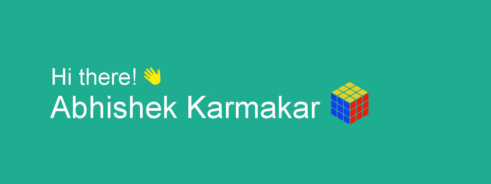

  
  

## Abhishek Karmakar

- I am a **Full Stack Developer** and a **Solutions Expert**
- 7+ years of experience building full-scale applications, end-to-end
- Passionate about coding and solving puzzles
- Based in Bangalore, India

 

## Preferred Stack

- React+Typescript (Core)
- Rsuite/SASS (Styling)
- MobX (State Managemnet)
- Axios/API Sauce (API)
- Node/Express (Backend)
- Postgress SQL (Database)
- Vite/Ionic/Electron (Deployment)

 

## Skills

  <h4>Languages & Frameworks</h4>
  
  
  
  
  
  
  
  
  
   
  
  
  
  
  
  
  
  
  
  
  
  
  
  
  
  
  
  
  
  
  
  
  
  
  
  
  
  
  
  
  
  
  
  
  
  
  
  
  
  
  
  
  
  <h4>Database</h4>
  
  
  
  
  
  
  
  
  
  
  
  
  <h4>Server</h4>
  
  
  
  
  
  
  
  
  
  
  

  <h4>Testing</h4>
  
  
  

  <h4>Build & Deployment</h4>
  
  
  
  
  
  
  
  
  
  
  
  
  
  
  <h4>Tools</h4>
  
  
  
  
  
  
  
  
   
  
  
  
  
  
  
  
  
  
  
  
  
  
  

 

## Contact me

  

 

## Contributions

  

###
